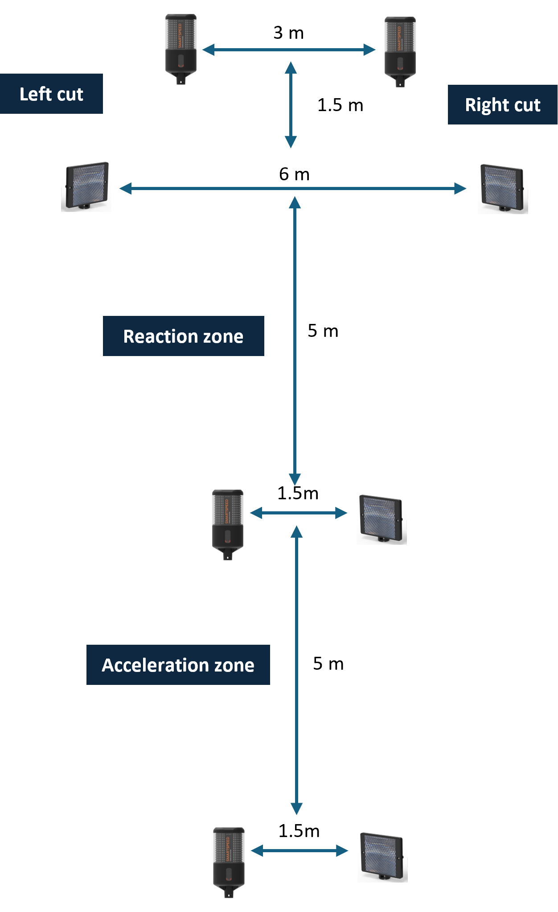

# AFLW Testing Battery

---

## Bilateral Countermovement Jump

**Equipment:** ForceDecks/Hawkins Dynamics

### Purpose

Lower-limb power and asymmetry during jumping and landing.

**Why?** Forceful athletes are exposed to greater tissue loading. CMJ is a quick & easy general test of force production that correlates strongly with other athletic tasks.

### Setup

- One foot on each force plate
- Feet self-selected width apart
- Hands on hips

### Protocol

- Stand still for ≥1 s before movement
- Perform a quick countermovement to a self-selected depth
- Immediately transition into a maximal vertical jump
- Keep hands on hips throughout
- Land with one foot on each plate
- Stabilise quickly after landing
- Reset position with a couple of seconds rest
- Repeat for 3 trials in one recording

### Key Variables

- Jump height (cm)
- Peak force (N)
- Asymmetry (%)

### Cues

- “Quick down, quick up”
- “Jump as high as possible”

---

## Single-Leg Triple Vertical Hop

**Equipment:** HumanTrak

### Purpose

Trunk and knee control during single-leg jump-landings

**Why?** Trunk lateral position is a main contributor to knee/ankle torque, and therefore, ligament loading. Knee valgus increases ACL loading. Task designed to be forceful, challenge single-leg control, continuous motion with rebound, and take attention away from movement.

### Setup

- Stand on one leg
- Opposite leg off the ground
- Hands on hips

### Protocol

- Perform 3 consecutive maximal vertical jumps on the same leg
- Minimise ground contact time between hops
- Stick and stabilise after the final landing
- Reset position with a couple of seconds rest
- Complete 3 trials per leg

### Key Variables

- Trunk lateral flexion (**°**)
- Trunk flexion (**°**)
- Knee flexion (**°**)
- Dynamic knee valgus (2D medial knee displacement) (**°**)
- Hop height (cm)
- Contact time (ms)

### Cues

- “Jump as high as possible”
- “Head through the roof on every jump”
- "Quick ground contact"

---

## Isometric Hip Adduction and Abduction Strength

**Equipment:** ForceFrame

### Purpose

Assess maximal strength of the hip adductor and abductor muscle groups

**Why?** Hip muscle strength important for controlling pelvis position and femur alignment that contributes to knee/ankle ligament injury. Hip adductor muscle strains common in hip/groin pain.

### Setup

- Lying supine (on back)
- Legs straight (hip and knee 0 degrees)
- Arms by sides
- Align pads with ankle malleolli

### Protocol

- Gradually build force
- Hold peak effort for ~3–5 s or until force plateus
- Alternate between inwards (adduction) and outwards (abduction)
- Complete 3 trials per side for each direction

### Key Variables

- Peak force (N)
- Adduction asymmetry (%)
- Abduction asymmetry (%)

### Cues

- “Squeeze or push as hard as possible”
- “GO! GO! GO!”

---

## Eccentric Knee Flexor Strength

**Equipment:** NordBord

### Purpose

Assess maximal strength of the knee flexor muscle group during a Nordic hamstring exercise.

**Why?** Hamstring strains commonly occur during eccentric contractions. The Nordic hamstring exercise is an easy way to tests supra-maximal strength (i.e., force above 1RM due to eccentric only phase).

### Setup

- Kneel on padded surface
- Hooks superior to ankle malleoli
- Hooks should be as vertical as possible
- Body upright, hips extended,
- Hands ready at chest for ground contact

### Protocol

- Slowly lean forward from the knees
- Maintain straight line from shoulders to knees
- Lower chest to the ground under control
- Catch body with hands when unable to hold position
- Reset position and rest a few seconds
- Repeat 3 times

### Key Variables

- Peak force (N)
- Asymmetry (%)

### Cues

- “Chest up, hips forward”
- “HOLD! HOLD! HOLD!”

---

## Isometric Knee Extension Strength

**Equipment:** DynaMo

### Purpose

Assess maximal strength of the knee extensor muscle group

**Why?** Knee extensor strength underpins acceleration, deceleration, and landing performance.

### Setup

- Seated position with knee just passed edge
- Knee flexed to 70°
- Feet off the ground
- Holding onto sides of seat
- *Optional*: strap around hips.
- Dynamometer strap around ankle
- Strap secured underneath/behind seat
- Strap approximately 90° to lower leg

### Protocol

- Gradually build force over ~1–2 s
- Hold peak contraction for ~3–5 s
- Pull down into seat to stop hips rising
- Complete 3 trials per side (in a row for convinence)

### Key Variables

- Peak force (N)
- Asymmetry (%)

### Cues

- “Kicking out and build slowly”
- “KICK! KICK! KICK!”

---

## Isometric Seated Calf Strength

**Equipment:** ForceFrame

### Purpose

Assess maximal strength of the plantarflexor muscle group

**Why?** Seated with bent knee biases soleus, which is commonly strained.

### Setup

- Seated with knee under the pad
- Knee positioned over toes
- Heel flat on the ground
- Adjust height to stop plantarflexion
- Holding onto the ForceFrame

### Protocol

- Push down through forefoot
- Gradually build to maximal effort
- Hold for ~3–5 s
- Complete 3 trials per side

### Key Variables

- Peak force (N)
- Asymmetry (%)

### Cues

- “Push through forefoot”
- “PUSH! PUSH! PUSH!”

---

## Ankle Dorsiflexion Range of Motion

**Equipment:** DynaMo

### Purpose

Ankle dorsiflexion range of motion in lunging position (knee-to-wall)

**Why?** Dorsiflexion enables greater movement options and prevents componsentation by proximal joints.

### Setup

- DyanMo strapped to side of leg
- Shoe off
- Lunge position
- Test side foot placed flat on ground
- Heel in contact with the floor
- Opposite knee supporting weight

### Protocol

- Lunge knee forward over toes
- Keep heel flat on ground at all times
- Move until maximal dorsiflexion is reached
- Record angle of tibia relative to vertical
- Repeat for 2–3 trials per side

### Key Variables

- Peak angle (deg)
- Asymmetry (%)

### Cues

- "Drive knee forward"
- “Push heel down”

---

## Isometric Neck Strength

**Equipment:** DyanMo

### Purpose

Assess maximal strength and rate of force development of the neck muscle groups in flexion, extension, and lateral flexion (left and right)

**Why?** Neck muscle force production may improve head-neck control during collisions

### Setup

- Athlete seated or standing
- Neutral head and trunk position
- Device or resistance applied in test direction

### Protocol

- Test flexion, extension, left lateral flexion, and right lateral flexion
- For maximal strength trials, gradually build force over ~1–2 s and hold maximal contraction for ~3–5 s
- For rate of force development trials, contract as fast and hard as possible from rest and hold briefly for ~1–2 s
- Maintain posture and alignment
- Complete 2–3 trials per direction

### Key Variables

- Peak force (N)
- Rate of force development (N/s)
- Directional asymmetry

### Cues

- “Push hard and fast”

---

## 3D Body Scan

**Equipment:** HumanTrak

### Purpose

Full body anthropometric measurements

**Why?** Limb lengths is a key determinant of joint torques, and therefore, ligament loading and muscle force required to produce movement.

### Setup

- Stand front on to the camera
- Standing up straight
- Arms slightly away from body (A pose)

### Protocol

- Stand still
- Complete single capture

### Key Variables

- Height
- Segment lengths
- Body dimensions

### Cues

- “Stand tall & relaxed”
- "Arms out to the side"

---

## Reactive change of direction

**Equipment:** OpenCap + SmartSpeed

### Purpose

Movement analysis during reactive running change of direction (sidestep))

**Why?** Reactive sidestep testing captures cutting mechanics in a more sport-specific setting. Change of direction commonly associated with knee/ankle ligament injuruies.

### Setup

- 4 x gates
- Gate 1 to 2 times the 5m accleration
- Gate 2 triggers either a left or right cut
- Direction is random

### Protocol

- Start behind gate 1
- Acclerate through the first 5m as fast as possible
- Respond to light on gate and change direction to the left or right
- Acclerate through the left/right gate as a fast as possible
- Complete as many trials as need to get 3 in each direction

### Key Variables

- 5m time (s)
- Change of direction time (s)
- Knee flexion (*°*)
- Knee valgus (*°*)
- Trunk lateral flexion (*°*)

### Cues

- “Run through the gates as fast as possible"
- "Don't try guess"
